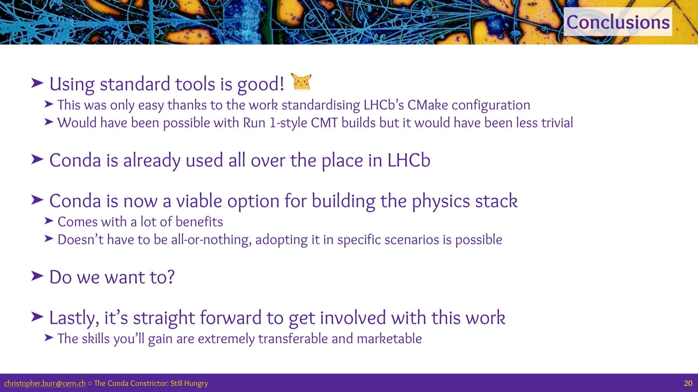
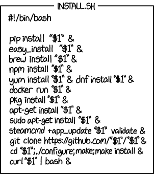
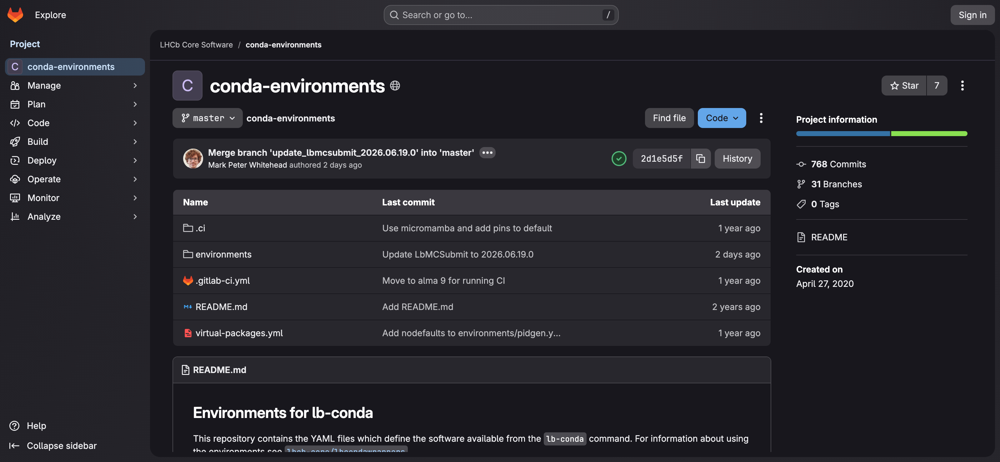
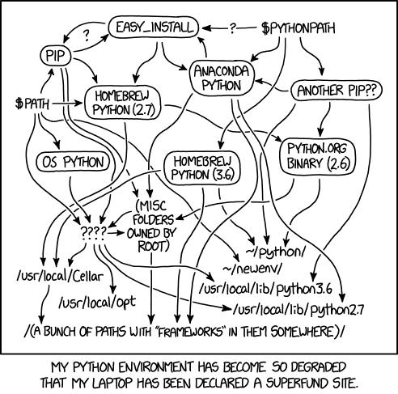

# What are we talking about today?

- Follow up to my [talk at the Computing workshop in January](https://indico.cern.ch/event/1583864/contributions/6885847/)

<figure>
  
</figure>

- I'm not going to talk about using conda for building the stack<sup>*</sup>

<div class="footnotes">
  <div class="footnote">* Hopefully next time 😉</div>
</div>

---

<!-- _class: section -->

# What problem are we trying to solve?

---

# What is a package manager?

<div class="cols">
<div>

- It installs software **and all of its dependencies** for you.
- It resolves a set of mutually-compatible versions so things actually work together.
- The hard part is gluing everything together
- `apt`, `pip`, `conda`, `spack`, ... each manage a different ecosystem.

</div>
<div>



<p class="src"><a href="https://xkcd.com/1654/">xkcd 1654</a></p>

</div>
</div>

---

<!-- _class: build -->

# How does it help LHCb?

- From one perspective LHCb (and HEP) has solved this problem
  - Install software on CVMFS
  - Call a script like lb-run/lb-conda/lb-dirac/"`source .../setup.sh`"

- But this is a very specific solution, it doesn't solve:
  - How to put software on CVMFS?
  - What about locally without CVMFS/EL9?
  - What if I want different software installed?
  - What if I want to develop software?

---

# **Problem:** How to put software on CVMFS?

- We more-or-less have this solved, but...
  - Installing software from LCG is time consuming and causes delays
  - lb-conda is updated by making an MR to [`lhcb-core/conda-environments`](https://gitlab.cern.ch/lhcb-core/conda-environments)
    - Still causes delays and gives less flexibility

<figure>
  
</figure>

---

# **Problem:** What about locally without CVMFS/EL9?

<div class="cols">
<div>

- **Primary answer:** Don't...
- Can use docker/apptainer maybe, but has never been well maintained.

</div>
<div>


<p class="src"><a href="https://xkcd.com/1988/">xkcd 1988</a></p>

</div>
</div>


---

# **Problem:** What if I want different software installed?

<div class="cols">
<div>

- **Primary answer:** Don't...
- Can maybe try editing `PATH` or `LD_LIBRARY_PATH`?
  - High chance of non-trivial issues

</div>
<div>



<p class="src"><a href="https://xkcd.com/1987/">xkcd 1987</a></p>

</div>
</div>

---

# **Problem:** What if I want to develop software?

- [`lb-stack-setup`](https://gitlab.cern.ch/lhcb-core/dev-tools/lb-stack-setup) works well for developing LHCb software.
- What about testing a small fix in ROOT?
  - Wait until it's merged, LCG nightlies are updated, then finally test the fix
  - Low chance of building ROOT in a way which will work with DaVinci
- Non-trivial developments across non-LHCb projects?
  - No chance without significant effort (e.g. GEANT4)

---

# **An aside:** What about containers?

- Container images can standardise distribution
  - But they don't help you create the image in the first place
- Containerisation "technology" also provides some runtime benefits
  - e.g. give me a different operating system, hide from the host, security etc.
- CVMFS solves the distribution problem for LHCb
  - It's a custom content distribution network (CDN) for software in HEP++

---

<!-- _class: section -->

# Current status of conda

---

# It's been a while...

> Looking back at your PyHEP 2019 conda-forge talk (interesting to see how much has stayed the same over 6+ years)

<figure>
  
  <figcaption><a href="https://indico.cern.ch/event/833895/contributions/3577783/">Packaging for Python and Beyond &mdash; PyHEP 2019</a></figcaption>
</figure>

---

<!-- _class: build -->

# What has changed?

- Compiler toolchains are now much more mature
    - Originally hard to use outside of conda builds
    - Now they're very mature and well maintained
- Tooling is much faster
    - Used to advertise getting ROOT in under 5 minutes
    - Now it can be ~10 seconds
- Pixi provides a lot of "user experience" improvements

---

<!-- _class: section -->

# Pixi

---

# What does Pixi give you?

<!-- _class: build -->


- Workspace model of working
  - Add a `pixi.toml` to describe the software you need
  - Can contain multiple environments for different use cases
  - Can also describe commands to run in the environment ("tasks")

- Pixi then takes care of generating a lock file
  - Ensures that everyone has the same software installed<sup>*</sup>
  - This should typically be committed to the repository<sup>†</sup>

<div class="footnotes">
  <div class="footnote">* Assuming the same OS (Linux/macOS) and CPU architecture.</div>
  <div class="footnote">† Tools like renovate can be used to automatically update the lock file periodically.</div>
</div>

- 🪄 Pixi takes care of managing all of the software environments for you 🪄

---

# What does this look like in practice?

<!-- _class: build -->

- I'm going to take DiracX as an example
  - This is a fairly extreme case, don't take the `pixi.toml` as an example!
- Running the unit tests is as simple as having pixi installed and running:

```
$ git clone git@github.com:DIRACGrid/diracx.git
$ cd diracx/
$ pixi run pytest-diracx
...
===== 446 passed, 42 skipped, 1 xfailed, 28 warnings in 35.77s =====
```

- DiracX has 30 different software environments for different use cases
  - Developers don't need to think about them at all...

---

# More examples...

- Completely different software environment is used for this one:

```
$ pixi run pytest-gubbins
===== 58 passed, 2 skipped, 1 warning in 10.58s =====
```

- A non-trivial tooling script for running code generation

```
$ pixi run generate-client
Please select an environment to run the task in: ›
❯ diracx-generate-client
  gubbins-generate-client
...
===== 1 passed, 1 warning in 91.27s (0:01:31) =====
```

---

# Nothing is so perfect...

- The main trade off is disk space and IO usage
  - Pixi tries to be smart with reflinking/hardlinks, laziness, etc.
- It's fine on a local NVMe drive (e.g. your laptop)
  - On hard drives it's not ideal but manageable
  - On AFS it's almost unusable
  - Having it in every grid job would be a disaster (there is a reason we have CVMFS!)

---

<!-- _class: section -->

# Can we have our cake and eat it?

---

# Can we have our cake and eat it?

<!-- _class: build -->

- What does "installing a conda package" mean?
  1. Download and extract the package to the local cache
  2. "Copy" the files to the install location
  3. Apply any necessary fixes (e.g. shebangs, hard coded paths, python stuff, ...)
- RattlerFS is a virtual filesystem which implements step 2+3
  - Proxies data from the local cache to the install location on demand
  - No need to copy files, no disk usage or IO overhead!

---

# One step further with CVMFS

> Download and extract the package to the local cache

- We already have a tool for that: CVMFS!
- Cache all conda-forge packages on CVMFS
  - RattlerFS can proxy them to the install location on demand:


```bash
$ ls /cvmfs/conda-cache.cern.ch/prototype-v2/*
linux-64/  noarch/  osx-arm64/
```

---

# RattlerFS status

- This works on Linux/macOS/Windows using FUSE/NFS/ProjFS<sup>*</sup>
- The upstream package that provides conda tooling (`rattler`) is interested
- "Just" need to open the (large) pull request...

<div class="footnotes">
  <div class="footnote">* Not all backends work on all operating systems</div>
</div>

---

<!-- _class: section -->

# Some asides

---

# Security

- This involves installing random software from the internet
    - Recent supply-chain attacks: [xz](https://www.openwall.com/lists/oss-security/2024/03/29/4), [Ultralytics](https://blog.pypi.org/posts/2024-12-11-ultralytics-attack-analysis/), [torchtriton](https://pytorch.org/blog/compromised-nightly-dependency/)
- Should use [dependency cooldowns](https://pixi.prefix.dev/latest/security/#2-delay-fresh-uploads-with-exclude-newer)
    - Only install software that is more than a few days old
    - Hope malicious software is discovered by someone else first
- Should use [dependency pinning](https://pixi.prefix.dev/latest/security/#3-pin-dependencies)
    - i.e. commit the lock file like I already mentioned

---

# Global

- Often you want to install some tools which are always available
    - [ripgrep](https://github.com/BurntSushi/ripgrep), [htop](https://hisham.hm/htop/), [pre-commit](https://pre-commit.com/), [git](https://git-scm.com/), etc.
- You can install these globally with `pixi global install <package>`
    - This makes a small environment per tool
    - Only a single wrapper binary is added to your PATH, which will then call the tool in its own environment
    - No more having junk on path due to it being an indirect dependency of some other tool

---

<!-- _class: build -->

# Summary

- The workspace model really changes how you think about software management
  - Not unique to pixi, but I don't know anything else that is language/platform agnostic

- I think we should use pixi for any repository where we need software management
    - e.g. anything that has a `requirements.txt` or `environment.yaml`

- With RattlerFS we can think about better integration with computing resources
  - Think next iteration of `lb-conda` (without breaking everything we already have)

- At CHEP there was a [talk about coordinating conda efforts across HEP](https://matthewfeickert-talks.github.io/talk-chep-2026/)
  - Lots of interest and see a lot of activity as a result (e.g. SHiP and Belle2)

---

<!-- _class: section -->

# Questions?
