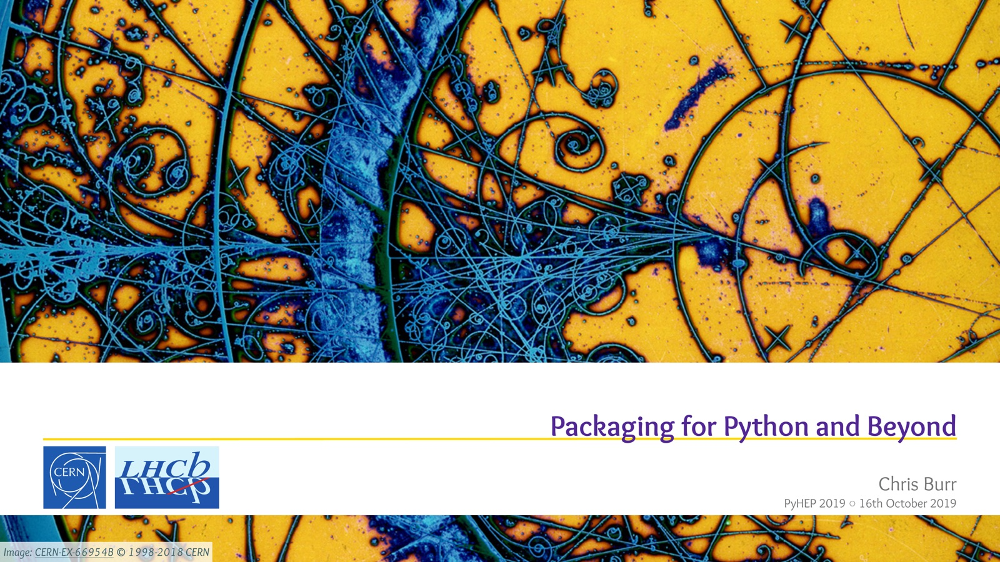
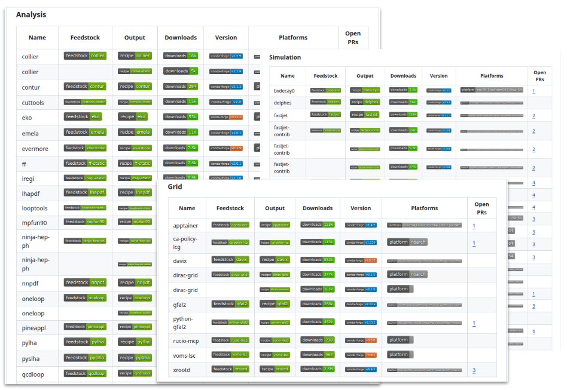

# Preface

<!-- _class: build -->

- Software packaging is a complex topic and this is a short talk
- For the purpose of this talk:
<br>

> Software packaging is a means to get software in a reproducible and reliable way

- Will break this down into three parts:

<div class="cols3">
<div>

🛠️ **Tooling**

install & manage environments

</div>
<div>

📦 **Packages**

recipes & binaries

</div>
<div>

🧑‍💻 **Development**

build & iterate

</div>
</div>

---

<!-- _class: section -->

# Tooling

---

# What is the conda **ecosystem**?

<!-- _class: build -->


1. Installer tools for software packages and their dependencies:
   - `conda create ...`
   - `pixi init`
1. A channel for distributing software packages: `conda-forge`
1. A file format for binary packages: `.conda`
1. Tools for building packages:
   - `conda-build`
   - `rattler-build`
1. Distributed cyberinfrastructure for building conda packages coherently: https://github.com/conda-forge/

---

# What is the conda ecosystem **not**?

<!-- _class: build -->

1. An operating system wide package manager (like `apt` or `yum`)
    - In the context of HSF use cases these aren't very interesting

1. A language specific package manager (like `pip`)
    - Conda packaging format is **language agnostic**
    - Can package C/C++, Fortran, Rust, Python, Go, R ...

1. Anaconda, Inc. (the company)
    - Conda is a community project with a varied elected steering council
    - Conda-forge packages are **free and open source**
    - Anaconda supports conda-forge, but is only a small fraction of the community
    - Anaconda's paid offerings are not interesting to HEP users

1. Something new

---

# It's been a while...

> Looking back at your PyHEP 2019 conda-forge talk (interesting to see how much has stayed the same over 6+ years)

<figure>
  
  <figcaption><a href="https://indico.cern.ch/event/833895/contributions/3577783/">Packaging for Python and Beyond &mdash; PyHEP 2019</a></figcaption>
</figure>

---

<!-- _class: build -->

# What has changed?

- Compiler toolchains are now much more mature
    - Originally hard to use outside of conda builds
    - Now they're very mature and well maintained, [including CUDA](https://github.com/conda-forge/cuda-feedstock/blob/main/recipe/doc/end_user_compile_guide.md)
- Tooling is much faster
    - Used to advertise getting ROOT in under 5 minutes
    - Now it can be **~10 seconds** 🚀

    ```
    pixi global install root
    pixi global expose add --environment root pyroot=python
    ```
- [Pixi](https://pixi.prefix.dev/) provides a lot of "user experience" improvements

---

# What does Pixi give you?

<!-- _class: build -->


- Workspace model of working
  - Add a `pixi.toml` Pixi manifest to describe the software you need
  - Can contain **multiple environments** and **multiple platforms** <br>for different use cases
  - Can also describe commands to run in the environment ("tasks")

- Pixi then automatically takes care of generating a digest-level lock file
  - Ensures that everyone has the same software installed<sup>*</sup>
  - This should typically be committed to the repository<sup>†</sup>

<div class="footnotes">
  <div class="footnote">* Assuming the same OS (Linux/macOS) and CPU architecture.</div>
  <div class="footnote">† Tools like renovate can be used to automatically update the lock file periodically.</div>
</div>

- 🪄 Pixi takes care of managing all of the software environments for you 🪄

---

<!-- _class: section -->

# But where do the packages come from?

---

# Getting packages

- How to build software ("recipes")
- How to avoid building software ("binaries")
- How to know it will work together

---

# Binary distribution

<!-- _class: build -->

- Conda is primarily a binary package manager
     - Recipes are used to build binaries for multiple platforms
     - Binaries are distributed via "channels", the most popular of which is [conda-forge](https://anaconda.org/channels/conda-forge)
- Potentially a different model that what you're used to, but is a very pragmatic approach
- For two binaries to be compatible it doesn't matter:<sup>†</sup>
     - Which C++ compiler was used to build them
     - Which C++ standard is used
     - Which Linux distribution you use

<div class="footnotes">
  <div class="footnote">† This is massively over simplified but we don't have time to go into the details here.</div>
</div>

---

# conda-forge


- Shared CI and distribution infrastructure.
- ~7800 contributors, 33,000+ packages, 43 billion+ downloads
     - contributors maintain one or more packages
     - core team maintains the infrastructure keeps the ecosystem healthy
- Heavy use of automation to manage version updates, rebuilds, and ABI change "migrations"
- Isn't frozen: you can contribute to add / update / fix packages
   - Uploaded binaries are immutable, associated metadata isn't
- HEP leadership:
   - Chris Burr is member of core leadership team
   - Chris Burr, Matthew Feickert are members of conda-forge/staged-recipes review team

---

# The HEP Packaging Coordination project

<div class="cols">
<div>

- A community project to get **as much HEP software as possible** onto conda-forge.
   - Directed by: Chris Burr, <br>Matthew Feickert, Lindsey Gray, Giordon Stark, ...you!
- Contributors across HEP: ATLAS, Belle II, CMS, LHCb, IRIS-HEP, LEGEND, ROOT, Scikit-HEP, SHiP, ROOT, DIRAC, theory/pheno...
- **120+ HEP packages** already: ROOT, Pythia8, FastJet, Awkward Array, Rivet, CMS Combine, ...
- Installing should be trivial

</div>
<div>

<figure>
  
  <figcaption><a href="https://hep-packaging-coordination.github.io/.github/">hep-packaging-coordination</a></figcaption>
</figure>

</div>
</div>

---

<!-- _class: section -->

# Development

---

# What is development?

<!-- _class: build -->

- Someone writing
     - libraries for general use (e.g. ROOT, FastJet, Rivet, Pythia, ...).
     - software for a specific experiment (e.g. LHCb, ATLAS, CMS, Belle II, ...).
     - a niche analysis tool for use inside an experiment
- Someone doing
     - analysis for physics
     - quick one-off detector study

---

# Pixi-build

<!-- _class: build -->

- The workspace model mentioned works really well for all of these cases
     - No global state which can prevent you from working on multiple projects
     - Collaborate effectively by having the same software everywhere
- Pixi-build takes this a step further: you can depend on unreleased software
     - Point to branches in git repositories
     - Point to local clones of your dependencies
- Kind of like Python's editable installs except for any language

---

# An aside: Use of Conda in LHCb

- Most LHCb software is on conda-forge (even extremely LHCb-specific software)
- Already used for:
     - User login environment on CVMFS/lxplus
     - All grid middleware
     - Hosting web services
     - User analysis environments on CVMFS (lb-conda)
     - Local user environments
- Notably exception is the "physics stack"
     - Have been experimenting with this more recently
     - Extremely promising, main questions are around the nicest way to integrate it

---

# Summary

- Conda-forge provides the recipes/binaries
- The Conda community provides the tooling
- HEP packaging coordination coordinates efforts within HEP

<div class="fineprint">

Links:

- HEP Packaging Coordination — <https://hep-packaging-coordination.github.io/.github/>
- Matthew's CHEP 2026 talk — <https://matthewfeickert-talks.github.io/talk-chep-2026/>
- "Conda, Pixi and RattlerFS" — <https://talks.chrisburr.me/2026-06-22-pixi-and-rattlerfs/>

</div>

---

<!-- _class: section -->

# Questions?

---

<!-- _class: section -->

# Backup

---

# What does typical end-user use look like?
<!-- _class: build -->

```
$ pixi init example && cd example  # create workspace
$ pixi add contur  # declaratively add tools
✔ Added contur >=3.1.4,<4
$ pixi run contur ...  # execute commands or tasks
$ pixi list rivet  # inspect environments
Name   Version  Build                 Size  Kind   Source
rivet  4.1.3    py314h9404863_2  53.69 MiB  conda  https://conda.anaconda.org/conda-forge
$ pixi shell  # drop into interactive subshells

(debug) $ command -v contur
/tmp/example/.pixi/envs/default/bin/contur
```
