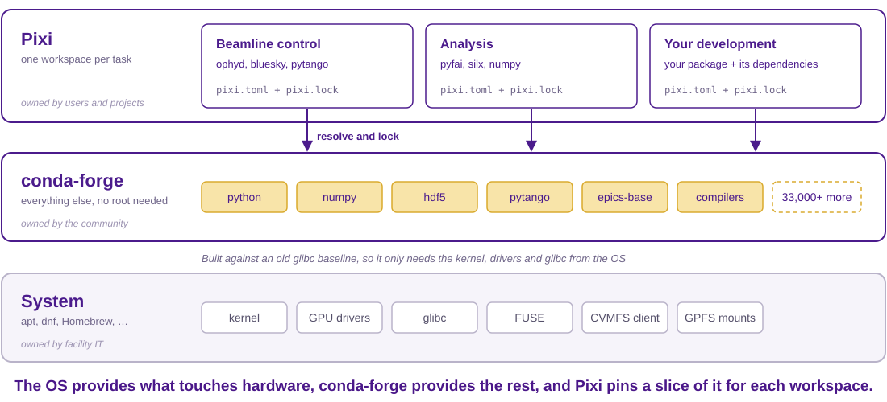
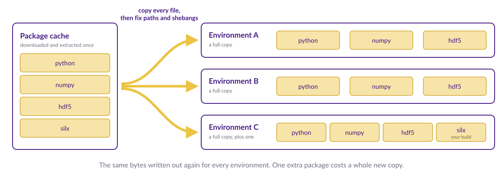
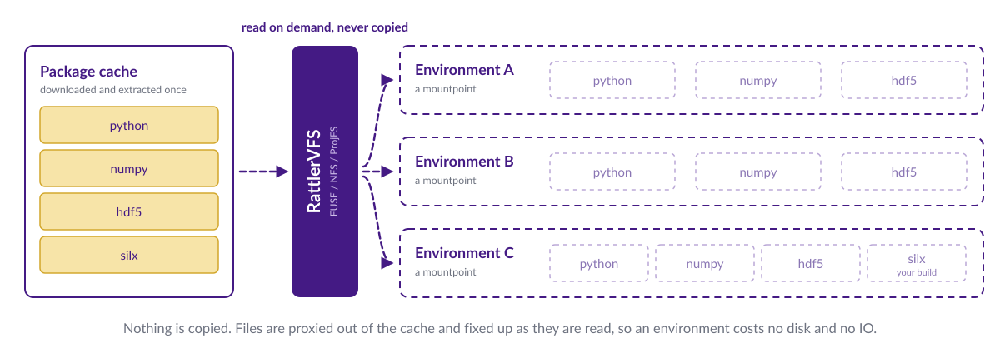
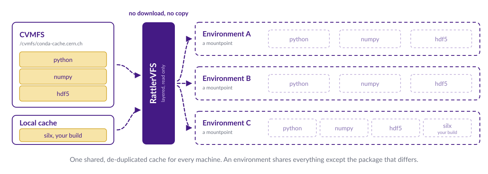
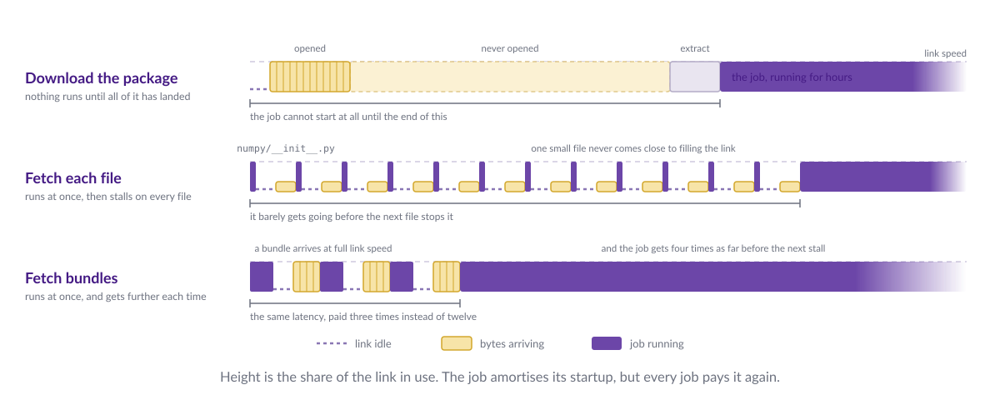
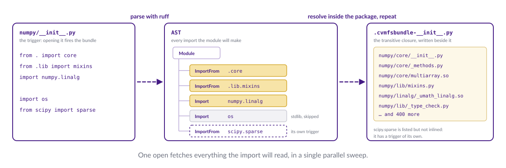

<style>
/* Deck-local: the schematics in assets/*.svg are wide line drawings that carry
   their own heading and caption, so they want the full width of whatever box
   they land in and none of the theme's figure frame. */
section figure.diagram { margin-top: var(--sp-3); }
section figure.diagram img { max-width: 100%; max-height: 100%; border: none; }

/* Deck-local: "who would we do this with" annotations on the what's-left list,
   styled as if scrawled on in red pen. Handwriting faces are system fonts, so
   they render here and in the PDF; elsewhere it falls back to generic cursive. */
section .who {
  font-family: "Bradley Hand", "Noteworthy", "Marker Felt", "Segoe Print", cursive;
  font-weight: 700;
  font-style: normal;
  font-size: 1.05em;
  line-height: 1;                 /* don't let the inline-block grow the line box */
  color: #C62828;
  margin-left: 0.4em;
  display: inline-block;
  transform: rotate(-1.5deg) translateY(-2px);
}
</style>

# Who am I?

- **Chris Burr**, CERN — I work on software and computing for LHCb
    - PhD in particle physics, but I always had more of a computing/software interest
    - "Primary" job involves grid-computing, also responsible for LHCb's use of CVMFS
- Member of the [conda-forge](https://conda-forge.org/) core leadership team
- I help direct the [HEP Packaging Coordination](https://hep-packaging-coordination.github.io/.github/) community packaging effort

---

<!-- _class: build card -->

# Pixi and conda-forge in 60 seconds


- [conda-forge](https://conda-forge.org/) is community-run build and distribution infrastructure
    - ~7800 contributors, 33,000+ packages, heavily automated
    - **Not Python specific** — C/C++, Fortran, Rust, Java, Julia, R, Perl, …
    - **Your ecosystem is already on it:** bluesky, ophyd, pytango, pyfai, silx,<br/>dials, tomopy, nexusformat, hdf5plugin

- [Pixi](https://pixi.prefix.dev/) is the workspace-shaped way to use it<sup>*</sup>
    - A `pixi.toml` describes the environments you need, a lock file makes them reproducible
    - No root, no modules, and the same environment on a laptop, a beamline PC and a cluster

<div class="footnotes">
  <div class="footnote">* Julian Hofer (prefix.dev) is giving the keynote on Wednesday and will give more details.</div>
</div>

<!-- step -->

<figure class="diagram">
  <!-- width/height: this SVG only carries a viewBox, so the img needs the
       intrinsic size or it collapses to nothing. -->
  
</figure>

---

<!-- _class: build -->

# **Problem:** environments are millions of small files

<div class="footnotes">
  <div class="footnote">* Even with reflink/hardlink tricks you can end up with 100s of GBs of software environments  </div>
</div>

- A conda/pixi environment is a *copy* of every file in every package
    - Fine(ish)<sup>*</sup> on a local NVMe drive, painful on a shared filesystem, a disaster for batch
    - I'm told EuXFEL sees up to **50 s** loading files from GPFS before a user job starts

- Facilities pre-cook environments centrally, works until someone wants to change something
    - Making your own workspace gives you a whole new environment
    - **You pay the full price of an environment to add one package**

- This is exactly the same problem I saw in LHCb


---

# CVMFS in 60 seconds

- A read-only filesystem served over HTTP and aggressively cached
    - Content-addressed and de-duplicated: an identical file is stored and downloaded once
    - Files arrive **on demand** — mount a 100 TB repository, download only what you open
    - It's a Content Delivery Network (CDN) for software

- Several of you already use it to distribute analysis code (ESRF, SOLEIL, ALBA)

- **The bit that matters today:**
    - CVMFS is good at making a huge read-only tree appear on every machine
    - The global infrastructure is already there

---

<!-- _class: build card -->

# What does "installing" actually mean?

- Installing a conda package is three steps:
    1. Download and extract the package to the local cache
    2. "Copy" the files to the install location
    3. Apply any necessary fixes (shebangs, hard coded paths, Python stuff, ...)

- **Steps 2 and 3 are the expensive bit** — disk, inodes and IO, paid again for every environment

<!-- step -->

<figure class="diagram">
  
</figure>

---

<!-- _class: build card -->

# RattlerVFS: make steps 2 and 3 virtual

- A virtual filesystem which implements steps 2 and 3, on demand
    - No copying, no disk usage, no IO overhead
    - An environment stops being a directory tree and becomes a mountpoint

- Works on Linux/macOS/Windows using FUSE/NFS/ProjFS<sup>*</sup>

<div class="footnotes">
  <div class="footnote">* Not all backends work on all operating systems.</div>
</div>

<!-- step -->

<figure class="diagram">
  
</figure>

---

<!-- _class: code -->

# Demo: RattlerVFS in action

- The RattlerVFS underpinnings are in good shape [conda/rattler#2566](https://github.com/conda/rattler/pull/2566)
- I have a proof-of-concept Pixi integration<sup>*</sup>

- Prebuilt binaries: [`chrisburr/pixi-rattlerfs`](https://github.com/chrisburr/pixi-rattlerfs)
    - A rebranded build of my pixi fork, so it can live beside a real `pixi`

```bash
$ pixi-rattlerfs run python -c "import numpy; print(numpy.__file__)"
```

<div class="footnotes">
  <div class="footnote">* This was a personal prototype and is in no way endorsed by the prefix.dev team!</div>
</div>

<!-- TODO: record a short terminal capture (asciinema/GIF) rather than demoing live
     over Zoom, and put the numbers in:
       - environment creation time, cold and warm
       - same thing on GPFS/NFS vs RattlerVFS
       - file count / inodes and disk usage for a typical analysis environment
     Two numbers people remember beats a wall of output. -->

---

<!-- _class: build card -->

# One step further with CVMFS

> 1. Download and extract the package to the local cache

- We already have a tool for that: CVMFS!
    - `/cvmfs/conda-cache.cern.ch` holds the extracted conda-forge cache
    - Add a custom local layer if needed
    - RattlerVFS proxies it, mutating the data in-flight as needed

- conda environments no longer have IO cost

<!-- step -->

<figure class="diagram">
  
</figure>

---

<!-- _class: build card -->

<!-- TODO: title — alternatives if you prefer: "Downloading, but less of it",
     "**Problem:** latency, not bandwidth", "Making cold starts cheap" -->

# **Problem:** cold starts cost round trips, not bytes

- CVMFS is better than downloading
    - **Content addressed downloads:** deduplicate at the file level, not the package level
    - **Download files on-demand:** don't pay for files in an environment you don't use

- But downloading at the file level makes you sensitive to latency...

- CVMFS's new "file bundle" feature fixes this (see [CHEP 2026](https://indico.cern.ch/event/1471803/contributions/6967096/))
    - Can use heuristics to know files that will be used together (e.g. Python static analysis)
    - Proof of concept: [chrisburr/cvmfs-filebundle-gen](https://github.com/chrisburr/cvmfs-filebundle-gen)

<!-- step -->

<figure class="diagram">
  
</figure>

<!-- step -->

<figure class="diagram">
  
</figure>


---

# What's left to do

<div class="reveal-group">

- **Upstreaming:**
  - this has to land in `rattler`
  - the `pixi` side of things needs to be designed/implemented

</div>

<div class="reveal-group">

- **CVMFS tuning and set up:**
  - file bundles and catalogue layout for this access pattern
  - how to host a common repository (like unpacked.cern.ch?)

</div>

<div class="reveal-group">

  - **Integration:** with your facilities and tools?

</div>

<div class="reveal-group">

- **Extensions:** PyPI wheels? direct libcvmfs?

</div>

---

# What's left to do<span class="who">with whom?</span>

<div class="reveal-group">

- **Upstreaming:** <span class="who">with prefix.dev</span>
  - this has to land in `rattler`
  - the `pixi` side of things needs to be designed/implemented

</div>

<div class="reveal-group">

- **CVMFS tuning and set up:** <span class="who">with CERN and conda-forge</span>
  - file bundles and catalogue layout for this access pattern
  - how to host a common repository (like unpacked.cern.ch?)

</div>

<div class="reveal-group">

  - Integration with your facilities and tools?

</div>

<div class="reveal-group">

- **Extensions:** PyPI wheels? direct libcvmfs? <span class="who">with prefix.dev</span>

</div>

---

<!-- _class: section -->

# Asides

---

# HEP Packaging Coordination

- Maintaining builds requires work and sometimes expertise
- conda-forge is the baseline but community projects are useful for specific applications
- I'd recommend keeping within the conda-forge channel by default

<div class="cols">
<div>

- [HEP Packaging Coordination](https://hep-packaging-coordination.github.io/.github/)
  - **120+ packages:** ROOT, Pythia8, FastJet, Rivet, ...
  - ATLAS, Belle II, CMS, DIRAC, LHCb, SHiP, Scikit-HEP, ...

</div>
<div>

<figure class="diagram">
  
  <figcaption><a href="https://hep-packaging-coordination.github.io/.github/">hep-packaging-coordination</a></figcaption>
</figure>

</div>
</div>

---

<!-- _class: build -->

# Long term reproducibility and maintenance

- In LHCb we have the need to:
  - have stability during a year of data-taking without being frozen
  - keep maintaining that software and its dependencies indefinitely

- For example:
  1. Start the year with a frozen baseline
  2. During the year: Need to make minimal changes to the baseline
  3. End of year: Continue indefinitely while still making minor patches as needed

- This doesn't match conda-forge's rolling release model
  - Tooling to support this would be straightforward
  - **Do you have a similar need?**

---

<!-- _class: build -->

# Summary

- Conda-forge+pixi can provide everything that is needed in userspace

- **RattlerVFS makes an environment a mountpoint instead of a copy**
    - Point it at a conda-forge cache on CVMFS: no download, no copy, no IO
    - A user can add their one package without giving up the shared install

- The pieces exist today: `rattler_vfs`, a Pixi prototype, a cache on CVMFS at CERN
    - What's left is upstreaming, CVMFS tuning, and integrating into your workflows

- **Mostly I just want this to exist**
    - Happy to lead parts of it, happy for someone else to lead parts of it
    - If it fits the LEAPS-Infratech call, even better

---

<!-- _class: section -->

# Questions?
