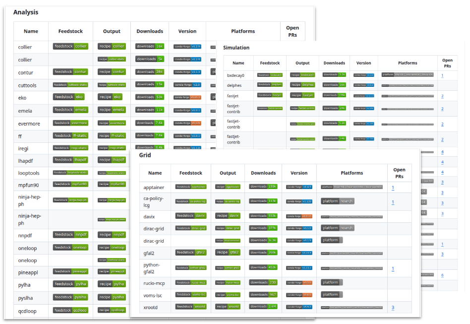

# Who am I?

- **Chris Burr**, CERN — I work on software and computing for LHCb
    - PhD in particle physics, but I always had more of a computing/software interest
    - "Primary" job involves grid-computing
- Member of the [conda-forge](https://conda-forge.org/) core leadership team
- I wrote the thing this talk is about (`rattler-fs`)
- I help direct [HEP Packaging Coordination](https://hep-packaging-coordination.github.io/.github/)
    - A community effort to get HEP software onto conda-forge
- I'm here because Graeme told me your problem sounds exactly like ours

---

<!-- _class: build -->

# Pixi and conda-forge in 60 seconds


- [conda-forge](https://conda-forge.org/) is community-run build and distribution infrastructure
    - ~7800 contributors, 33,000+ packages, heavily automated
    - **Not Python specific** — C/C++, Fortran, Rust, Java, Julia, R, Perl, …
    - **Your ecosystem is already on it:** bluesky, ophyd, pytango, pyfai, silx, dials, tomopy, nexusformat, hdf5plugin

- [Pixi](https://pixi.prefix.dev/) is the workspace-shaped way to use it
    - A `pixi.toml` describes the environments you need, a lock file makes them reproducible
    - No root, no modules, and the same environment on a laptop, a beamline PC and a cluster

<div class="footnotes">
  <div class="footnote">* Julian Hofer (prefix.dev) is giving the keynote on Wednesday and will do this properly.</div>
</div>

---

<!-- _class: build -->

# **Problem:** environments are millions of small files

<div class="footnotes">
  <div class="footnote">* Even with reflink/hardlink tricks you can end up with 100s of GBs of software environments  </div>
</div>

- A conda/pixi environment is a *copy* of every file in every package
    - Fine(ish)<sup>*</sup> on a local NVMe drive, painful on a shared filesystem, a disaster in every job
    - I'm told EuXFEL sees up to **50 s** loading files from GPFS before a user job starts

- Facilities pre-cook environments centrally, works until someone wants to change something
    - Making your own workspace gives you a whole new environment
    - **You pay the full price of an environment to add one package**

- This is the exactly same problem I saw in LHCb


---

# CVMFS in 60 seconds

- A read-only filesystem served over HTTP and aggressively cached
    - Content-addressed and de-duplicated: an identical file is stored and downloaded once
    - Files arrive **on demand** — mount a 100 TB repository, download only what you open
    - It's a Content Delivery Network (CDN) for software

- Several of you already use it to distribute analysis code (ESRF, SOLEIL, ALBA)

- **The bit that matters today:**
    - CVMFS is extremely good at making a huge read-only tree appear on every machine, and paying for it once
    - The global infrastructure is already there

---

<!-- _class: build -->

# What does "installing" actually mean?

- Installing a conda package is three steps:
    1. Download and extract the package to the local cache
    2. "Copy" the files to the install location
    3. Apply any necessary fixes (shebangs, hard coded paths, Python stuff, ...)

- Step 1 is already shared between every environment you have

- **Steps 2 and 3 are the expensive bit** — disk, inodes and IO, paid again for every environment

---

# RattlerVFS: make steps 2 and 3 virtual

- RattlerVFS is a virtual filesystem which implements steps 2 and 3
    - Proxies data from the cache into the install location on demand
    - No copying, no disk usage, no IO overhead

- An environment stops being a directory tree and becomes a mountpoint
    - Creating one is close to free, and throwing one away costs nothing

- Works on Linux/macOS/Windows using FUSE/NFS/ProjFS<sup>*</sup>

<div class="footnotes">
  <div class="footnote">* Not all backends work on all operating systems.</div>
</div>

---

<!-- _class: code -->

# Demo: RattlerVFS in action

- The RatterVFS underpinnings are in good shape [conda/rattler#2566](https://github.com/conda/rattler/pull/2566)
- I have a proof-of-concept Pixi integration<sup>*</sup>

- Prebuilt binaries: [`chrisburr/pixi-rattlerfs`](https://github.com/chrisburr/pixi-rattlerfs)
    - A rebranded build of my pixi fork, so it can live beside a real `pixi`

```bash
$ pixi-rattlerfs run python -c "import numpy; print(numpy.__file__)"
```

<div class="footnotes">
  <div class="footnote">* This was a personal prototype and is in no way endorsed by the Prefix.dev team!</div>
</div>

<!-- TODO: record a short terminal capture (asciinema/GIF) rather than demoing live
     over Zoom, and put the numbers in:
       - environment creation time, cold and warm
       - same thing on GPFS/NFS vs RattlerVFS
       - file count / inodes and disk usage for a typical analysis environment
     Two numbers people remember beats a wall of output. -->

---

<!-- _class: build -->

# One step further with CVMFS

> Download and extract the package to the local cache

- We already have a tool for that: CVMFS!

- Put the extracted conda-forge cache on CVMFS and RattlerVFS proxies it into the environment:

```bash
$ ls /cvmfs/conda-cache.cern.ch/prototype-v2/*
linux-64/  noarch/  osx-arm64/
```

- Creating an environment is now neither a download nor a copy
    - A user's tweaked environment **shares everything except the package that differs**
    - The same environment on a laptop, a beamline PC and every node of the cluster

---

<!-- _class: build -->

# TODO think of a title

- CVMFS is better than downloading
    - **Content addressed downloads:** deduplicate at the file level, not the package level
    - **Download files on-demand:** don't pay for files in an environment you don't use

- But downloading at the file level makes you sensitive to latency...

- CVMFS's new "file bundle" feature fixes this
    - Can use heuristics to know files that will be used together (e.g. Python static analysis)
    - Proof of concept: [chrisburr/cvmfs-filebundle-gen](https://github.com/chrisburr/cvmfs-filebundle-gen)


---

# Status

- **RattlerVFS in Pixi:** [prefix-dev/pixi#6548](https://github.com/prefix-dev/pixi/pull/6548) is open
    - Seems to work surprisingly well, but will no doubt have some edges to polish

- **conda-forge on CVMFS:** a prototype repository at CERN, technically orthogonal to the above

- **prefix.dev are coming at the same problem from the other end**
    - Layered package caches and a [virtual filesystem layer](https://github.com/conda/rattler/issues/2059) — both in Wednesday's keynote
    - Nobody is working on the facility-scale half, which is the CVMFS half

---

<!-- _class: build -->

# What's left to do

- **Upstreaming:** this has to land in `rattler` and `pixi`, not live in my fork

- **CVMFS tuning:** file bundles and catalogue layout for this access pattern
    - An environment touches thousands of tiny files scattered across the whole tree
    - Cold starts are the worst case and the one users actually notice

- **Pluggable storage backends:** talk to `libcvmfs` directly instead of going via a FUSE mount
    - One layer fewer, straight to the CDN, no duplicated client-side cache

- **Operations:** mount lifecycle, user isolation on shared nodes, batch system integration

- **Publishing:** keeping 33,000 constantly-rebuilt packages current on CVMFS

---

# HEP is already doing this

<div class="cols">
<div>

- [HEP Packaging Coordination](https://hep-packaging-coordination.github.io/.github/): getting HEP software onto conda-forge
    - **120+ packages:** ROOT, Pythia8, FastJet, Rivet, ...
    - ATLAS, Belle II, CMS, DIRAC, LHCb, SHiP, Scikit-HEP, ...
- ATLAS and LHCb are looking at conda-forge as the basis of the physics stack

</div>
<div>

<figure>
  
  <figcaption><a href="https://hep-packaging-coordination.github.io/.github/">hep-packaging-coordination</a></figcaption>
</figure>

</div>
</div>

- **The point for you:** if photon science software is on conda-forge too, one CVMFS
  repository serves both communities — shared cost, and nobody runs their own

---

<!-- _class: build -->

# What could a LEAPS project look like?

- **Workstreams:**
    - Upstream RattlerVFS into `rattler` and `pixi` — *? FTE-yr*
    - conda-forge cache on CVMFS: publishing, catalogue and bundle tuning — *? FTE-yr*
    - `libcvmfs` storage backend and cold-start work — *? FTE-yr*
    - Facility integration and packaging photon-science software — *? FTE-yr*

- **What we'd need from facilities:** a pilot cluster or beamline, an existing CVMFS
  deployment to test against, and someone to complain loudly when it breaks

- **What you'd get:** environments that cost nothing to create, that users can extend
  without losing sharing, and that are identical everywhere

<!-- TODO: put real numbers on the workstreams — Linus flagged that the FTE-years
     question will come up, and a total with a breakdown survives questioning
     better than a single headline number. -->

---

<!-- _class: build -->

# Summary

- Environments on shared filesystems are the problem; CVMFS is the thing you already have
- **RattlerVFS makes an environment a view rather than a copy** — no download, no copy, no IO
- Working prototype today; the facility-scale half is a well-bounded project
- Happy to be the HEP half of a joint proposal

---

<!-- _class: section -->

# Questions?
